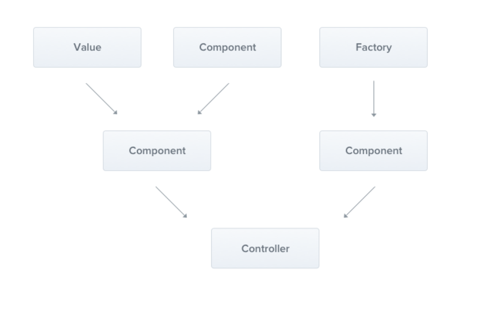

# Provider

- Some values, components, Factories can used from components.
- This components is used from Controller
- NestJS Runtime can inject (values, components, Factories) into some component, or controller.
- Providers provide tasks.
- Controllers delegate tasks to providers.
- Provicers are plain javascript classes that are declared as `providers` in a `module`

> The main idea of a provider is that it can be injected as a dependency; this means objects can create various relationships with each other, and the function of "wiring up" these objects can largely be delegated to the Nest runtime system.

- **`@injectable()`** It attaches metadata, which declares that `Class` can be managed by the Nest IOC container.



## How to use providers from conroller
- We must know that the injection is controlled by nestjs runtime.

```typescript
@Controller()
class SomeContoller {
  // Assume that Something is Injectable class
  constructor(private something: Something) {}
}
```

- The `something` **is injected through the class constructor**.
- The constructor shorthand allows us to declare member and initialize it immediately in the **same location**.

## Dependency Injection

### In angular docs
[링크](https://angular.dev/guide/di)
- Needs: use features from other classes.
  - HTTP service to make backend calls.
- DI is a mechanism for creating and delivering some parts of an application to other application that requires them. `(features -> features)`
- Service is a broad category encompassing any value, function, or feature that an application needs. A service is typically a class with a narrow, well-defined purpose. A component is one type of class that can use DI.


- Two main roles: **dependency consumer**, **dependency provider**
- The run-time program facilitates the interaction between consumer and provider using an abstraction.
- Providing dependency
  1. Use `@Injectable()` to show that the class can be injected.
  2. Literally provide that class
    1. into application level
    2. into component level: Component의 providers 옵션에 해당 클래스 레퍼런스를 전달

- Consuming dependency
  - Let the runtime inject provided dependency into **Something** by **somehow ways**  
  1. Declare(write) a reference of dep in consumer's(class) **constructor**.
    - The runtime determines which classes or other deps that this class needs by looking at the constructor parameter types.
  2. `inject(Dependency)` method
    - When runtime discovers that a class depends on other deps, It first check if the injector has any existing instance of that.
      If requested deps don't yet exist, the injector creates ones using the registerd provider, and adds it to the injector before returning the class to Runtime.
    - When all requested classes have been resolved and returned, Runtime can call the component's constructor with those services as arguments.

- Defining(Configuring) dependency providers.
  - Beside the classes, any javascript values can become dependency.
  - The runtime provides the necessary APIs to make the dependency configuration flexible, so you can makr those values available in DI.
  1. Class Provider Token
    - is a reference of class
    - The injector is to instantiate that class using the new operator.
    - Developer can configure DI to associate the A provider token with a different provider or any other value.
    - This is shorthand for:
      ```javascript
      { provide: InjectableDependency, useClass: InjectableDependency, deps: [] /*optional*/ }s
      ```

      1. `provide`: holds the token that serves as the key for consuming dependency value
      2. `useClass` tells the runtime to instantiate a provided class when a dependency is injected
      3. `useExisting` allows you to alias a token and reference any existing one.
      4. `useFactory` allows you to define a function that constructs a dependency
      5. `useValue` provides a static value that should be used as a dependency

## Provider scopes
- The scope means a lifetime of provider which is synchronized with the application lifecycle.
- When the application is bootstrapped, every dependency must be resolved, and therefore every provider has to be instantiated.
- When the application shuts down, each provider will be destoryed.
- There are ways to make providers lifetime **request-scoped** as well.